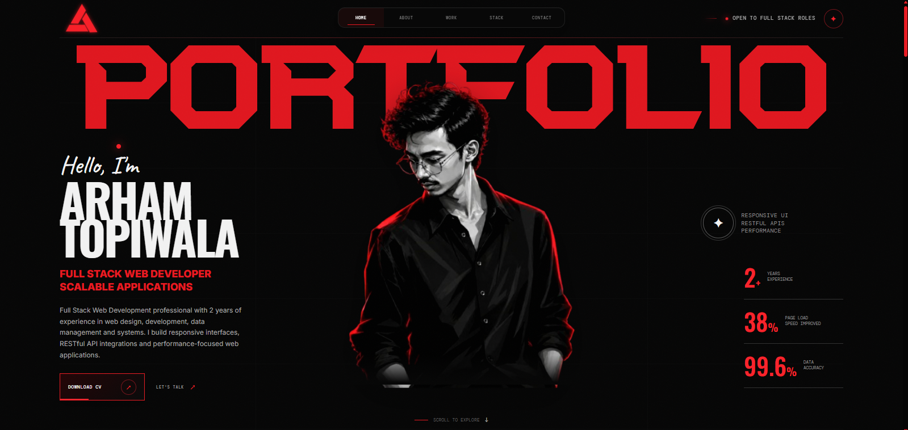

# ARHAM TOPIWALA — FULL STACK WEB DEVELOPER

> A dark, editorial portfolio engineered around one idea:  
> **make the interface feel like a digital product, not a résumé.**

---

## 01 — THE IDEA

This portfolio is a custom-built personal website for **Arham Topiwala**, a Full Stack Web Developer focused on scalable applications, RESTful API integrations, responsive UI engineering, performance optimization, and data-driven systems.

The experience intentionally avoids the traditional "developer portfolio" formula.

Instead of presenting a long list of technologies and generic project cards, the website uses:

- A cinematic black / crimson visual system
- Oversized editorial typography
- Layered typography and portrait composition
- Fixed navigation
- Motion-driven micro-interactions
- Custom loading experience
- Animated capability marquee
- Structured experience timelines
- Interactive technology panels
- Resume-backed achievements
- Responsive layouts across modern screen sizes

The goal is simple:

> **Turn professional information into a visual experience.**

✦ Developer Quote

  

---
